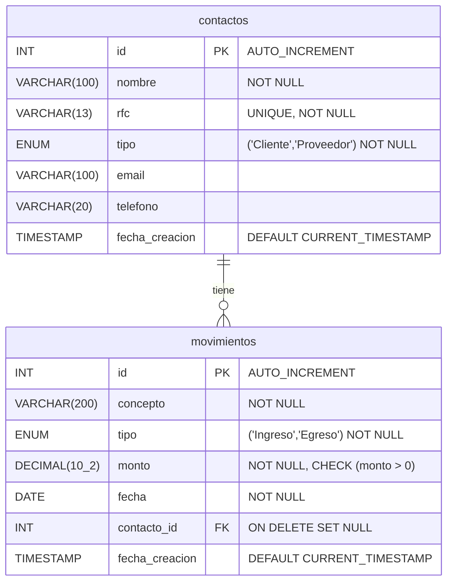

# Diagrama Entidad-Relación (DER) - ERP Contable

Puedes usar este código Mermaid para visualizar el diagrama. También puedes renderizarlo usando cualquier visor de Markdown que soporte Mermaid, o herramientas online como draw.io / Mermaid Live Editor.

> **Nota para la entrega:** Asegúrate de capturar este diagrama como imagen (`DER_erp_contable.png`) para agregarlo a tu PDF final.
